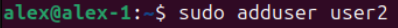
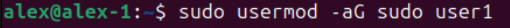
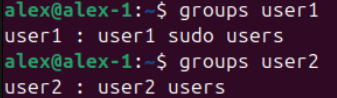
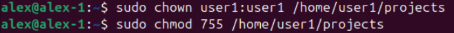
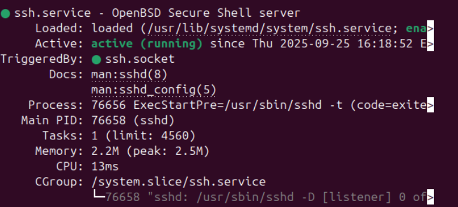
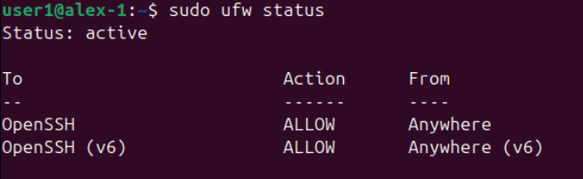
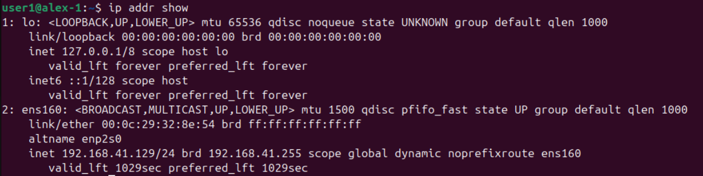
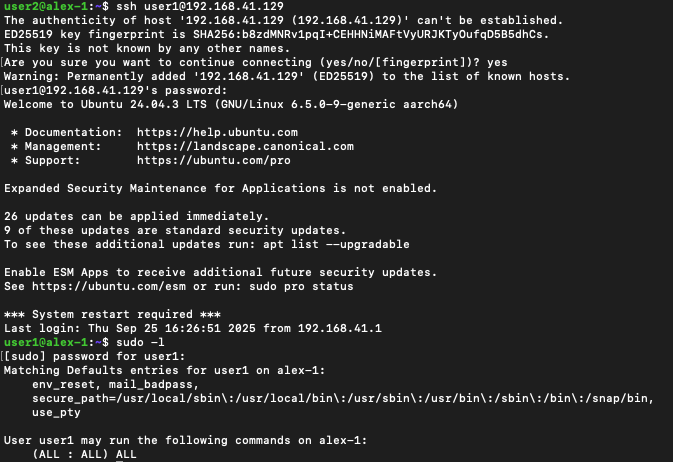
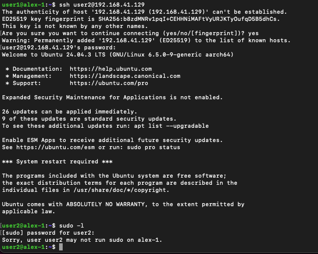

# linux-sysadmin-project-01
# User Management, SSH & Firewall 
##  Overview  
This mini project demonstrates essential Linux administration tasks:  
- Creating and managing users  
- Assigning sudo privileges  
- Setting up project directories  
- Enabling SSH for remote login  
- Configuring firewall (UFW) for security  
- Testing remote access from a MacBook host  

It’s a hands-on exercise designed to practice **junior SysAdmin / DevOps fundamentals**.  

---

## Steps & Screenshots  

### 1. Create Users  
Added two users:  
- user1 (with sudo rights)  
- user2 (no sudo access)  

  
  

---

### 2. Assign Sudo to `user1`  
Gave user1 administrator privileges.  

  

---

### 3. Verify Groups  
Confirmed group membership for both users.  

  

---

### 4. Create Project Directory  
Created /home/user1/projects and set proper permissions.  

  

---

### 5. Enable SSH  
Installed and activated SSH server.  

  

---

### 6. Configure Firewall  
Allowed SSH traffic with UFW.  

  

---

### 7. Get VM IP Address  
Checked the internal IP for remote connection.  

  

---

### 8. Remote SSH Access  
- Connected as user1 → sudo access works  
- Connected as user2 → no sudo rights  

  
  

---

##  Conclusion  
This project shows how to:  
- Manage Linux users and groups  
- Control access with sudo  
- Secure a server with SSH and UFW  
- Connect remotely from another machine  

A small but complete **Linux SysAdmin mini project** to showcase system administration fundamentals.  
